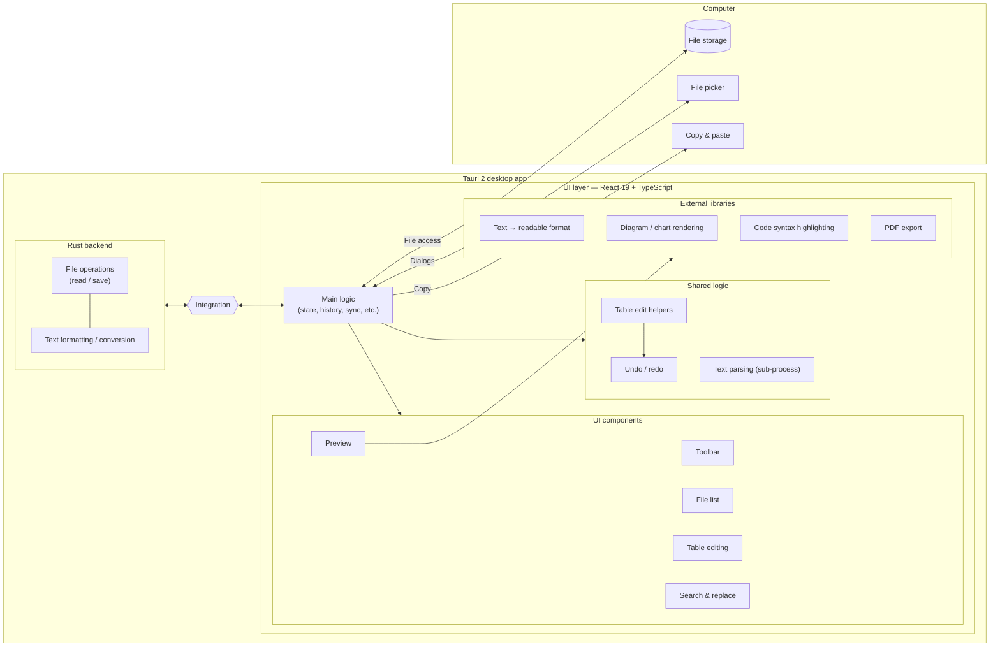
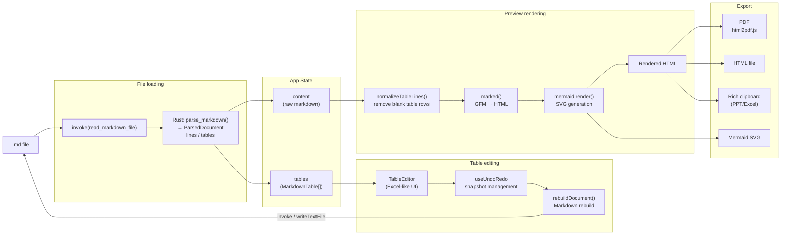
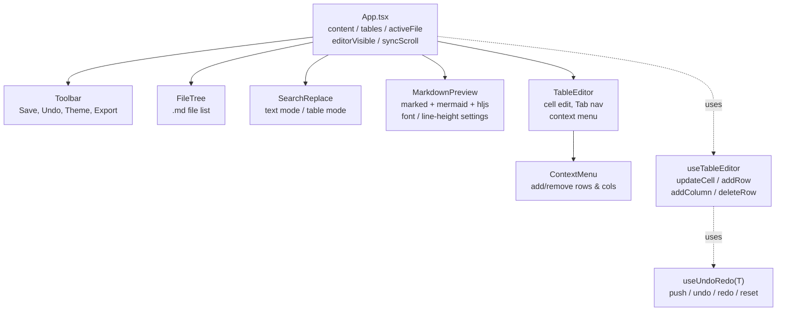

# Markdown Studio

[English](README.md) · [日本語](README.ja.md) · [简体中文](README.zh.md) · [Español](README.es.md) · [हिन्दी](README.hi.md) · **العربية** · [Português](README.pt.md)

محرّر Markdown لسطح مكتب Windows، مبني باستخدام Tauri 2 + React.

## المزايا

- **معاينة Markdown** — عرض فوري، مع جداول GFM وتمييز الشيفرة ومخططات Mermaid
- **وضع تحرير الجداول** — حرّر الجداول خلية بخلية بواجهة تشبه Excel
- **شريط أدوات التنسيق** — عريض ومائل وعناوين وقوائم وشيفرة وروابط والمزيد (Ctrl+B / Ctrl+I)
- **مزامنة التمرير** — إبقاء موضعَي التمرير في المحرّر والمعاينة متزامنَين
- **البحث والاستبدال** — يعمل في وضع المعاينة (النص كاملاً) وفي وضع تحرير الجداول على حد سواء
- **إعدادات الخط والعرض** — خطوط قابلة للضبط (بما في ذلك الخطوط اليابانية مثل Meiryo وYu Gothic وMS PMincho)، وحجم الخط، وارتفاع السطر
- **التصدير** — PDF وHTML وWord (.docx) ونسخ منسّق (غني) إلى الحافظة
- **شجرة الملفات** — افتح مجلداً وتصفّح ملفات `.md` وبدّل بينها
- **السمة** — تبديل بين الوضع الفاتح والداكن
- **إخفاء المحرّر** — التبديل إلى وضع المعاينة فقط (Ctrl+\\)
- **تراجع / إعادة** — سجل لعمليات التحرير
- **مساعدة الذكاء الاصطناعي** (اختياري) — حوّل النص المحدد (ترجمة، تلخيص، تدقيق لغوي، نقاط) وأنشئ مخططات Mermaid من وصف، باستخدام مفتاح API الخاص بك
- **واجهة متعددة اللغات** — 7 لغات (English, 日本語, 简体中文, Español, हिन्दी, العربية, Português)، تُكتشف تلقائياً من إعدادات لغة نظام التشغيل ويمكن تبديلها في أي وقت من الإعدادات

## التنزيل

**نسخة محمولة لنظام Windows 64-bit (لا تتطلب تثبيتاً):**

[markdown-sheet-v1.6.0.exe.dat](https://github.com/5843435/markdown-sheet/raw/main/markdown-sheet-v1.6.0.exe.dat)

> يُوزَّع بامتداد `.dat` من أجل البيئات التي يُحظر فيها التنزيل من GitHub Releases.

### خطوات الإعداد
1. نزّل الملف من الرابط أعلاه
2. أعد تسمية الملف إلى `markdown-sheet.exe`
3. **انقر بزر الماوس الأيمن على ملف exe ← Properties ← فعّل "Unblock" ضمن "Security: This file came from…" ← OK**
4. انقر نقراً مزدوجاً للتشغيل

## إعداد بيئة التطوير

```powershell
cd markdown-sheet
npm install
npm run tauri dev
```

## البناء (مثبّت MSI)

```powershell
cd markdown-sheet
npm run tauri build
```

تُكتب مخرجات البناء إلى `src-tauri/target/release/bundle/msi/`.

## المكدس التقني

| العنصر | التفاصيل |
| --- | --- |
| إطار العمل | Tauri 2 + React 19 |
| اللغة | TypeScript |
| أداة البناء | Vite 6 |
| محلّل Markdown | marked v17 (GFM) |
| المخططات | Mermaid v11 |
| تمييز بناء الجملة | highlight.js |
| تصدير PDF | html2pdf.js |
| التدويل | i18n مخصّص خفيف الوزن (7 لغات، بدون تبعيات وقت التشغيل) |

## اختصارات لوحة المفاتيح

| المفتاح | الإجراء |
| --- | --- |
| Ctrl+S | حفظ |
| Ctrl+Z | تراجع |
| Ctrl+Y | إعادة |
| Ctrl+B | عريض |
| Ctrl+I | مائل |
| Ctrl+F / Ctrl+H | البحث والاستبدال |
| Ctrl+Shift+C | نسخ منسّق |
| Ctrl+\\ | تبديل المحرّر |
| F11 | معاينة بملء الشاشة |

## التدويل

تأتي الواجهة بـ 7 لغات. عند التشغيل الأول يكتشف التطبيق لغة نظام التشغيل ويعود إلى English إن لم تكن مدعومة. يمكنك تغيير اللغة في أي وقت من **الإعدادات ← اللغة**؛ ويُحفظ اختيارك.

توجد الترجمات ضمن [markdown-sheet/src/i18n/locales/](markdown-sheet/src/i18n/locales/) — ملف واحد لكل لغة، وكلها مفهرسة مقابل `en.ts` (المصدر المرجعي). لإضافة لغة، أنشئ ملف `<code>.ts` جديداً ينفّذ كل مفتاح موجود في `en.ts` وسجّله في [markdown-sheet/src/i18n/index.tsx](markdown-sheet/src/i18n/index.tsx).

---

## البنية المعمارية

### الهيكل العام



### تدفق البيانات



### شجرة المكوّنات



## الرخصة

صادر بموجب [رخصة MIT](LICENSE).
