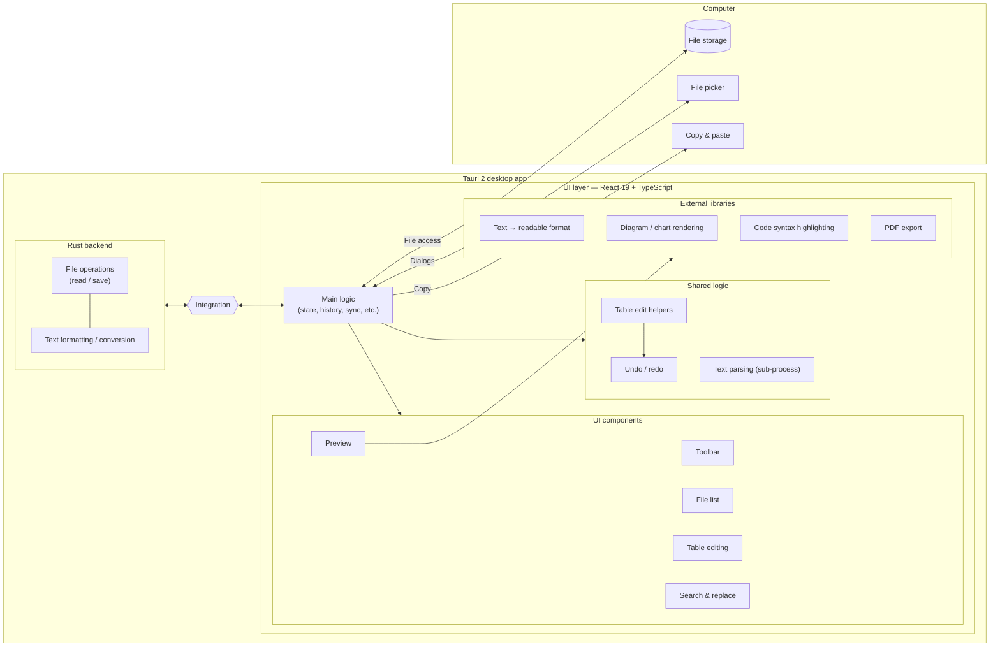
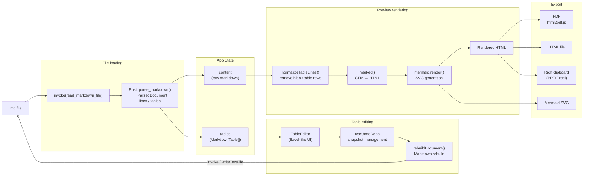
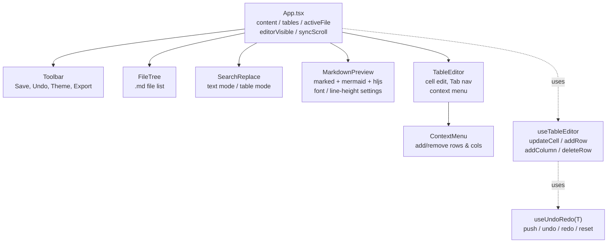

# Markdown Studio

[English](README.md) · [日本語](README.ja.md) · [简体中文](README.zh.md) · **Español** · [हिन्दी](README.hi.md) · [العربية](README.ar.md) · [Português](README.pt.md)

Un editor de Markdown para escritorio Windows, creado con Tauri 2 + React.

## Características

- **Vista previa de Markdown** — renderizado en tiempo real, con tablas GFM, resaltado de código y diagramas Mermaid
- **Modo de edición de tablas** — edita las tablas celda por celda con una interfaz al estilo de Excel
- **Barra de herramientas de formato** — negrita, cursiva, encabezados, listas, código, enlaces y más (Ctrl+B / Ctrl+I)
- **Sincronización de desplazamiento** — mantén sincronizadas las posiciones de desplazamiento del editor y la vista previa
- **Buscar y reemplazar** — funciona tanto en el modo de vista previa (texto completo) como en el modo de edición de tablas
- **Ajustes de fuente y presentación** — fuentes ajustables (incluidas fuentes japonesas como Meiryo, Yu Gothic, MS PMincho), tamaño de fuente y altura de línea
- **Exportación** — PDF, HTML, Word (.docx) y copia al portapapeles con formato enriquecido
- **Árbol de archivos** — abre una carpeta y navega o cambia entre archivos `.md`
- **Tema** — alternar entre claro y oscuro
- **Ocultar editor** — cambia al modo de solo vista previa (Ctrl+\\)
- **Deshacer / Rehacer** — historial de las operaciones de edición
- **Asistencia de IA** (opcional) — transforma el texto seleccionado (traducir, resumir, corregir, viñetas) y genera diagramas Mermaid a partir de una descripción, usando tu propia clave de API
- **Interfaz multilingüe** — 7 idiomas (English, 日本語, 简体中文, Español, हिन्दी, العربية, Português), detectados automáticamente según la configuración regional de tu sistema operativo y que puedes cambiar en cualquier momento en Ajustes

## Descarga

**Portable de 64 bits para Windows (no requiere instalación):**

[markdown-sheet-v1.6.0.exe.dat](https://github.com/5843435/markdown-sheet/raw/main/markdown-sheet-v1.6.0.exe.dat)

> Se distribuye con la extensión `.dat` para entornos donde las descargas desde GitHub Releases están bloqueadas.

### Pasos de configuración
1. Descarga desde el enlace anterior
2. Cambia el nombre del archivo a `markdown-sheet.exe`
3. **Haz clic derecho en el exe → Propiedades → marca "Desbloquear" en "Seguridad: este archivo proviene de…" → Aceptar**
4. Haz doble clic para ejecutar

## Configuración de desarrollo

```powershell
cd markdown-sheet
npm install
npm run tauri dev
```

## Compilación (instalador MSI)

```powershell
cd markdown-sheet
npm run tauri build
```

Los artefactos de compilación se escriben en `src-tauri/target/release/bundle/msi/`.

## Pila tecnológica

| Elemento | Detalles |
| --- | --- |
| Framework | Tauri 2 + React 19 |
| Lenguaje | TypeScript |
| Herramienta de compilación | Vite 6 |
| Analizador de Markdown | marked v17 (GFM) |
| Diagramas | Mermaid v11 |
| Resaltado de sintaxis | highlight.js |
| Exportación a PDF | html2pdf.js |
| Internacionalización | i18n personalizado y ligero (7 idiomas, sin dependencias en tiempo de ejecución) |

## Atajos de teclado

| Tecla | Acción |
| --- | --- |
| Ctrl+S | Guardar |
| Ctrl+Z | Deshacer |
| Ctrl+Y | Rehacer |
| Ctrl+B | Negrita |
| Ctrl+I | Cursiva |
| Ctrl+F / Ctrl+H | Buscar y reemplazar |
| Ctrl+Shift+C | Copia enriquecida |
| Ctrl+\\ | Alternar editor |
| F11 | Vista previa en pantalla completa |

## Internacionalización

La interfaz se distribuye en 7 idiomas. En el primer inicio, la aplicación detecta la configuración regional de tu sistema operativo y recurre al inglés si no es compatible. Puedes cambiar el idioma en cualquier momento desde **Ajustes → Idioma**; la elección se recuerda.

Las traducciones se encuentran en [markdown-sheet/src/i18n/locales/](markdown-sheet/src/i18n/locales/) — un archivo por idioma, todos referenciados contra `en.ts` (la fuente de verdad). Para agregar un idioma, crea un nuevo archivo `<code>.ts` que implemente todas las claves de `en.ts` y regístralo en [markdown-sheet/src/i18n/index.tsx](markdown-sheet/src/i18n/index.tsx).

---

## Arquitectura

### Estructura general



### Flujo de datos



### Árbol de componentes



## Licencia

Publicado bajo la [Licencia MIT](LICENSE).
