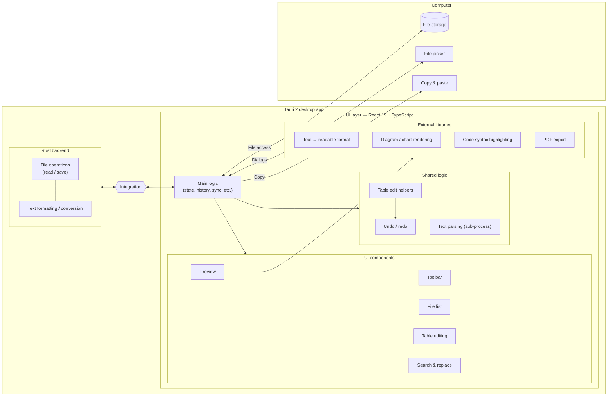
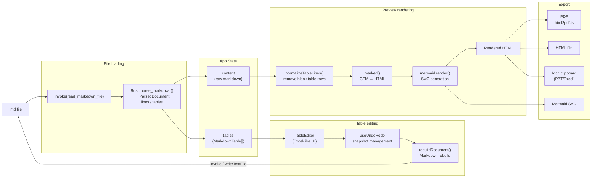
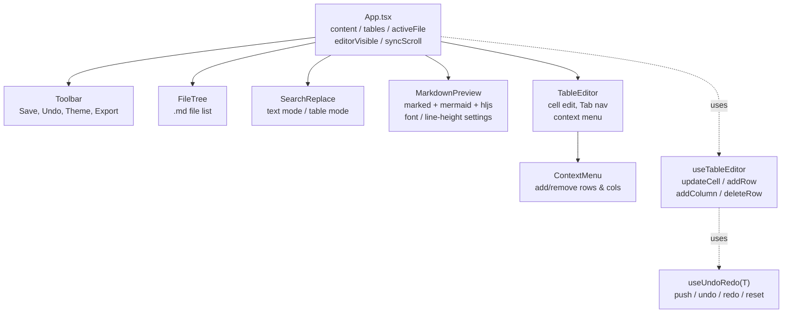

# Markdown Studio

[English](README.md) · [日本語](README.ja.md) · [简体中文](README.zh.md) · [Español](README.es.md) · **हिन्दी** · [العربية](README.ar.md) · [Português](README.pt.md)

Tauri 2 + React के साथ बनाया गया Windows डेस्कटॉप के लिए एक Markdown एडिटर।

## विशेषताएँ

- **Markdown प्रीव्यू** — रीयल-टाइम रेंडरिंग, GFM टेबल, कोड हाइलाइटिंग और Mermaid डायग्राम के साथ
- **टेबल एडिट मोड** — Excel जैसे UI के साथ टेबल को सेल-दर-सेल एडिट करें
- **फ़ॉर्मेटिंग टूलबार** — बोल्ड, इटैलिक, हेडिंग, सूचियाँ, कोड, लिंक और बहुत कुछ (Ctrl+B / Ctrl+I)
- **स्क्रॉल सिंक** — एडिटर और प्रीव्यू की स्क्रॉल स्थितियों को समकालिक रखें
- **खोजें और बदलें** — प्रीव्यू मोड (पूरा टेक्स्ट) और टेबल एडिट मोड दोनों में काम करता है
- **फ़ॉन्ट और डिस्प्ले सेटिंग्स** — समायोज्य फ़ॉन्ट (Meiryo, Yu Gothic, MS PMincho जैसे जापानी फ़ॉन्ट सहित), फ़ॉन्ट आकार और लाइन ऊँचाई
- **एक्सपोर्ट** — PDF, HTML, Word (.docx) और रिच (फ़ॉर्मेट किया गया) क्लिपबोर्ड कॉपी
- **फ़ाइल ट्री** — एक फ़ोल्डर खोलें और `.md` फ़ाइलों के बीच ब्राउज़ करें/स्विच करें
- **थीम** — लाइट / डार्क टॉगल
- **एडिटर छिपाएँ** — केवल-प्रीव्यू मोड पर स्विच करें (Ctrl+\\)
- **अनडू / रीडू** — एडिटिंग ऑपरेशनों के लिए हिस्ट्री
- **AI सहायता** (वैकल्पिक) — अपनी स्वयं की API key का उपयोग करके चयनित टेक्स्ट को रूपांतरित करें (अनुवाद, सारांश, प्रूफ़रीड, बुलेट) और विवरण से Mermaid डायग्राम बनाएँ
- **बहुभाषी UI** — 7 भाषाएँ (English, 日本語, 简体中文, Español, हिन्दी, العربية, Português), जो आपके OS लोकेल से स्वतः पहचानी जाती हैं और Settings में कभी भी बदली जा सकती हैं

## डाउनलोड

**Windows 64-bit पोर्टेबल (इंस्टॉल की आवश्यकता नहीं):**

[markdown-sheet-v1.6.0.exe.dat](https://github.com/5843435/markdown-sheet/raw/main/markdown-sheet-v1.6.0.exe.dat)

> ऐसे वातावरण के लिए `.dat` एक्सटेंशन के साथ वितरित किया गया है जहाँ GitHub Releases से डाउनलोड अवरुद्ध हैं।

### सेटअप चरण
1. ऊपर दिए गए लिंक से डाउनलोड करें
2. फ़ाइल का नाम बदलकर `markdown-sheet.exe` करें
3. **exe पर राइट-क्लिक करें → Properties → "Security: This file came from…" के अंतर्गत "Unblock" चेक करें → OK**
4. चलाने के लिए डबल-क्लिक करें

## डेवलपमेंट सेटअप

```powershell
cd markdown-sheet
npm install
npm run tauri dev
```

## बिल्ड (MSI इंस्टॉलर)

```powershell
cd markdown-sheet
npm run tauri build
```

बिल्ड आर्टिफ़ैक्ट `src-tauri/target/release/bundle/msi/` में लिखे जाते हैं।

## तकनीकी स्टैक

| आइटम | विवरण |
| --- | --- |
| फ़्रेमवर्क | Tauri 2 + React 19 |
| भाषा | TypeScript |
| बिल्ड टूल | Vite 6 |
| Markdown पार्सर | marked v17 (GFM) |
| डायग्राम | Mermaid v11 |
| सिंटैक्स हाइलाइटिंग | highlight.js |
| PDF एक्सपोर्ट | html2pdf.js |
| अंतरराष्ट्रीयकरण | हल्का कस्टम i18n (7 भाषाएँ, कोई रनटाइम निर्भरता नहीं) |

## कीबोर्ड शॉर्टकट

| Key | क्रिया |
| --- | --- |
| Ctrl+S | सहेजें |
| Ctrl+Z | अनडू |
| Ctrl+Y | रीडू |
| Ctrl+B | बोल्ड |
| Ctrl+I | इटैलिक |
| Ctrl+F / Ctrl+H | खोजें और बदलें |
| Ctrl+Shift+C | रिच कॉपी |
| Ctrl+\\ | एडिटर टॉगल करें |
| F11 | फ़ुल-स्क्रीन प्रीव्यू |

## अंतरराष्ट्रीयकरण

UI 7 भाषाओं में उपलब्ध है। पहली बार लॉन्च पर ऐप आपके OS लोकेल का पता लगाता है और यदि वह समर्थित नहीं है तो English पर वापस चला जाता है। आप **Settings → Language** से भाषा कभी भी बदल सकते हैं; चयन याद रखा जाता है।

अनुवाद [markdown-sheet/src/i18n/locales/](markdown-sheet/src/i18n/locales/) के अंतर्गत रहते हैं — प्रति भाषा एक फ़ाइल, सभी `en.ts` (सत्य का स्रोत) के आधार पर कीड की गई हैं। कोई भाषा जोड़ने के लिए, `en.ts` की हर key को लागू करते हुए एक नई `<code>.ts` बनाएँ और उसे [markdown-sheet/src/i18n/index.tsx](markdown-sheet/src/i18n/index.tsx) में पंजीकृत करें।

---

## आर्किटेक्चर

### समग्र संरचना



### डेटा प्रवाह



### कंपोनेंट ट्री



## लाइसेंस

[MIT License](LICENSE) के अंतर्गत जारी किया गया।
