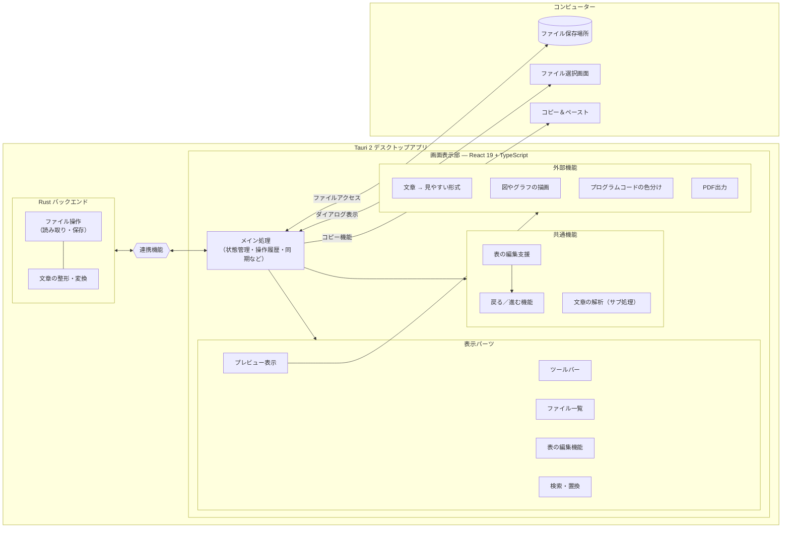
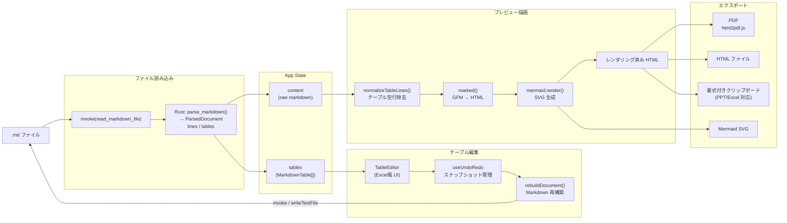
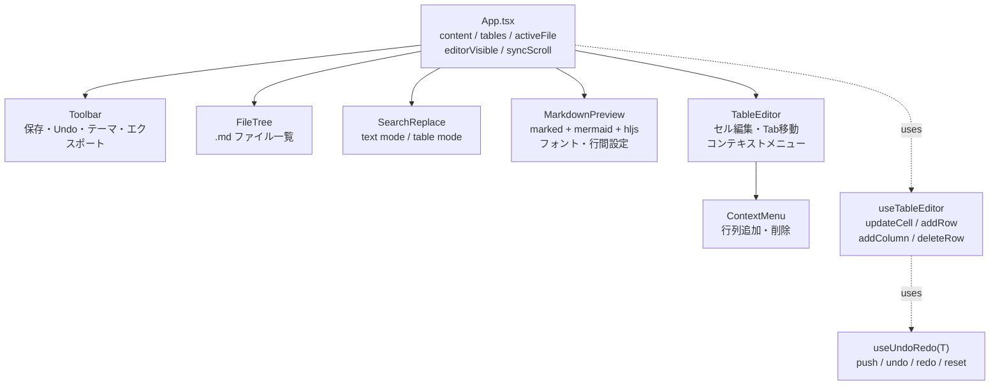

# Markdown Studio

Tauri 2 + React 製の Windows デスクトップ向け Markdown エディタ。

## 主な機能

- **Markdown プレビュー** — リアルタイムレンダリング、GFM テーブル・コードハイライト・Mermaid 図対応
- **テーブル編集モード** — Excel ライクな UI でテーブルをセル単位で編集
- **書式ツールバー** — 太字・斜体・見出し・リスト・コード・リンクなど（Ctrl+B / Ctrl+I）
- **スクロール同期** — エディタとプレビューのスクロール位置を連動
- **検索・置換** — プレビューモード（テキスト全体）／テーブル編集モード両対応
- **フォント・表示設定** — メイリオ / 游ゴシック / MS P明朝 など日本語フォントに対応、フォントサイズ・行間も調整可能
- **エクスポート** — PDF 出力、HTML エクスポート、書式付きクリップボードコピー
- **ファイルツリー** — フォルダを開いて `.md` ファイルを一覧表示・切替
- **テーマ** — ライト / ダーク切替
- **エディタ非表示** — プレビュー専用モードへ切替（Ctrl+\）
- **Undo / Redo** — テーブル編集の操作履歴

## 開発環境セットアップ

```powershell
cd C:\Tools\markdown-sheet\markdown-sheet
npm install
npm run tauri dev
```

## ビルド（MSI インストーラー）

```powershell
cd C:\Tools\markdown-sheet\markdown-sheet
npm run tauri build
```

ビルド成果物は `src-tauri/target/release/bundle/msi/` に出力されます。

## 技術スタック

| 項目 | 内容 |
| --- | --- |
| フレームワーク | Tauri 2 + React 19 |
| 言語 | TypeScript |
| ビルドツール | Vite 6 |
| Markdown パーサー | marked v17 (GFM) |
| 図ダイアグラム | Mermaid v11 |
| シンタックスハイライト | highlight.js |
| PDF 出力 | html2pdf.js |

## キーボードショートカット

| キー | 機能 |
| --- | --- |
| Ctrl+S | 保存 |
| Ctrl+Z | Undo |
| Ctrl+Y | Redo |
| Ctrl+B | 太字 |
| Ctrl+I | 斜体 |
| Ctrl+F / Ctrl+H | 検索・置換 |
| Ctrl+Shift+C | 書式付きコピー |
| Ctrl+\ | エディタ表示切替 |

---

## アーキテクチャ

### 全体構成



### データフロー



### コンポーネントツリー

