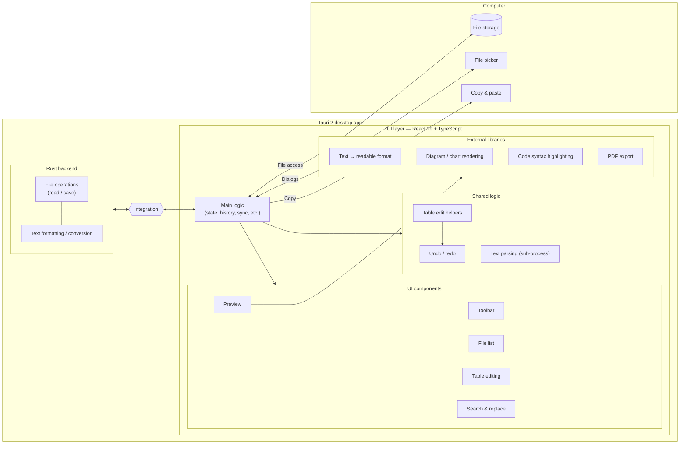
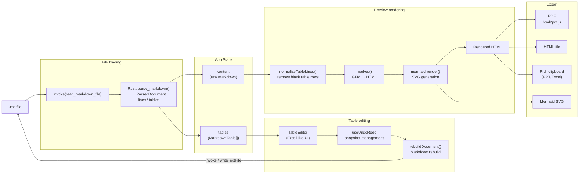
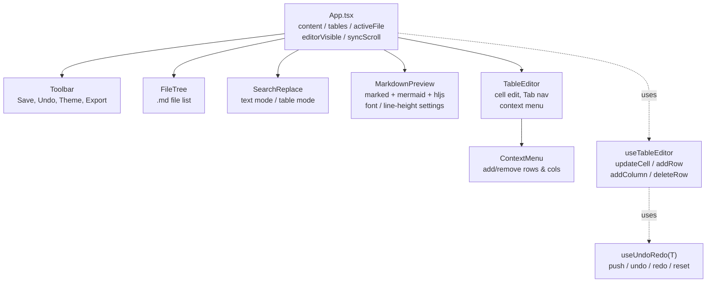

# Markdown Studio

**English** · [日本語](README.ja.md) · [简体中文](README.zh.md) · [Español](README.es.md) · [हिन्दी](README.hi.md) · [العربية](README.ar.md) · [Português](README.pt.md)

A Markdown editor for Windows desktop, built with Tauri 2 + React.

## Features

- **Markdown preview** — real-time rendering, with GFM tables, code highlighting, and Mermaid diagrams
- **Table edit mode** — edit tables cell by cell with an Excel-like UI
- **Formatting toolbar** — bold, italic, headings, lists, code, links, and more (Ctrl+B / Ctrl+I)
- **Scroll sync** — keep the editor and preview scroll positions in sync
- **Find & replace** — works in both preview mode (whole text) and table edit mode
- **Font & display settings** — adjustable fonts (including Japanese fonts such as Meiryo, Yu Gothic, MS PMincho), font size, and line height
- **Export** — PDF, HTML, Word (.docx), and rich (formatted) clipboard copy
- **File tree** — open a folder and browse/switch between `.md` files
- **Theme** — light / dark toggle
- **Hide editor** — switch to preview-only mode (Ctrl+\\)
- **Undo / Redo** — history for editing operations
- **AI assist** (optional) — transform selected text (translate, summarize, proofread, bullets) and generate Mermaid diagrams from a description, using your own API key
- **Multilingual UI** — 7 languages (English, 日本語, 简体中文, Español, हिन्दी, العربية, Português), auto-detected from your OS locale and switchable any time in Settings

## Download

**Windows 64-bit portable (no install required):**

[markdown-sheet-v1.6.0.exe.dat](https://github.com/5843435/markdown-sheet/raw/main/markdown-sheet-v1.6.0.exe.dat)

> Distributed with a `.dat` extension for environments where downloads from GitHub Releases are blocked.

### Setup steps
1. Download from the link above
2. Rename the file to `markdown-sheet.exe`
3. **Right-click the exe → Properties → check "Unblock" under "Security: This file came from…" → OK**
4. Double-click to run

## Development setup

```powershell
cd markdown-sheet
npm install
npm run tauri dev
```

## Build (MSI installer)

```powershell
cd markdown-sheet
npm run tauri build
```

Build artifacts are written to `src-tauri/target/release/bundle/msi/`.

## Tech stack

| Item | Details |
| --- | --- |
| Framework | Tauri 2 + React 19 |
| Language | TypeScript |
| Build tool | Vite 6 |
| Markdown parser | marked v17 (GFM) |
| Diagrams | Mermaid v11 |
| Syntax highlighting | highlight.js |
| PDF export | html2pdf.js |
| Internationalization | Lightweight custom i18n (7 languages, no runtime deps) |

## Keyboard shortcuts

| Key | Action |
| --- | --- |
| Ctrl+S | Save |
| Ctrl+Z | Undo |
| Ctrl+Y | Redo |
| Ctrl+B | Bold |
| Ctrl+I | Italic |
| Ctrl+F / Ctrl+H | Find & replace |
| Ctrl+Shift+C | Rich copy |
| Ctrl+\\ | Toggle editor |
| F11 | Full-screen preview |

## Internationalization

The UI ships in 7 languages. On first launch the app detects your OS locale and falls back to English if it isn't supported. You can change the language any time from **Settings → Language**; the choice is remembered.

Translations live under [markdown-sheet/src/i18n/locales/](markdown-sheet/src/i18n/locales/) — one file per language, all keyed against `en.ts` (the source of truth). To add a language, create a new `<code>.ts` implementing every key in `en.ts` and register it in [markdown-sheet/src/i18n/index.tsx](markdown-sheet/src/i18n/index.tsx).

---

## Architecture

### Overall structure


```mermaid
graph LR
    subgraph TAURI["Tauri 2 desktop app"]
        subgraph RUST["Rust backend"]
            CMD["File operations\n(read / save)"]
            RPARSER["Text formatting / conversion"]
            CMD --- RPARSER
        end

        IPC{{"Integration"}}

        subgraph WEBVIEW["UI layer — React 19 + TypeScript"]
            APP["Main logic\n(state, history, sync, etc.)"]

            subgraph COMP["UI components"]
                TBR["Toolbar"]
                FT["File list"]
                MP["Preview"]
                TE["Table editing"]
                SR["Search & replace"]
            end

            subgraph HOOKS["Shared logic"]
                UTE["Table edit helpers"]
                UUR["Undo / redo"]
                MDPJS["Text parsing (sub-process)"]
            end

            subgraph EXTLIB["External libraries"]
                MRK["Text → readable format"]
                MRM["Diagram / chart rendering"]
                HJS["Code syntax highlighting"]
                H2P["PDF export"]
            end
        end
    end

    subgraph OS["Computer"]
        FS[("File storage")]
        DLG["File picker"]
        CLIP["Copy & paste"]
    end

    RUST <--> IPC
    IPC <--> APP
    APP --> COMP
    APP --> HOOKS
    MP --> EXTLIB
    UTE --> UUR
    APP <-->|"File access"| FS
    APP <-->|"Dialogs"| DLG
    APP -->|"Copy"| CLIP
```

### Data flow


```mermaid
flowchart LR
    FILE[".md file"]

    subgraph LOAD["File loading"]
        IPC1["invoke(read_markdown_file)"]
        RPARSE["Rust: parse_markdown()\n→ ParsedDocument\n  lines / tables"]
    end

    subgraph STATE["App State"]
        CONTENT["content\n(raw markdown)"]
        TABLES["tables\n(MarkdownTable[])"]
    end

    subgraph PREVIEW_FLOW["Preview rendering"]
        NORM["normalizeTableLines()\nremove blank table rows"]
        MARKED["marked()\nGFM → HTML"]
        MERMAID["mermaid.render()\nSVG generation"]
        HTML["Rendered HTML"]
    end

    subgraph TABLE_FLOW["Table editing"]
        TABLED["TableEditor\n(Excel-like UI)"]
        UNDO["useUndoRedo\nsnapshot management"]
        REBUILD["rebuildDocument()\nMarkdown rebuild"]
    end

    subgraph EXPORT["Export"]
        PDF["PDF\nhtml2pdf.js"]
        HTMLEXP["HTML file"]
        CLIP["Rich clipboard\n(PPT/Excel)"]
        SVG["Mermaid SVG"]
    end

    FILE --> IPC1 --> RPARSE --> CONTENT & TABLES
    CONTENT --> NORM --> MARKED --> MERMAID --> HTML
    TABLES --> TABLED --> UNDO --> REBUILD
    REBUILD -->|"invoke / writeTextFile"| FILE
    HTML --> PDF & HTMLEXP & CLIP
    MERMAID --> SVG
```

### Component tree


```mermaid
graph TD
    App["App.tsx\ncontent / tables / activeFile\neditorVisible / syncScroll"]

    App --> Toolbar["Toolbar\nSave, Undo, Theme, Export"]
    App --> FileTree["FileTree\n.md file list"]
    App --> SearchReplace["SearchReplace\ntext mode / table mode"]
    App --> MarkdownPreview["MarkdownPreview\nmarked + mermaid + hljs\nfont / line-height settings"]
    App --> TableEditor["TableEditor\ncell edit, Tab nav\ncontext menu"]

    TableEditor --> ContextMenu["ContextMenu\nadd/remove rows & cols"]

    App -..->|uses| useTableEditor["useTableEditor\nupdateCell / addRow\naddColumn / deleteRow"]
    useTableEditor -..->|uses| useUndoRedo["useUndoRedo(T)\npush / undo / redo / reset"]
```

## License

Released under the [MIT License](LICENSE).
