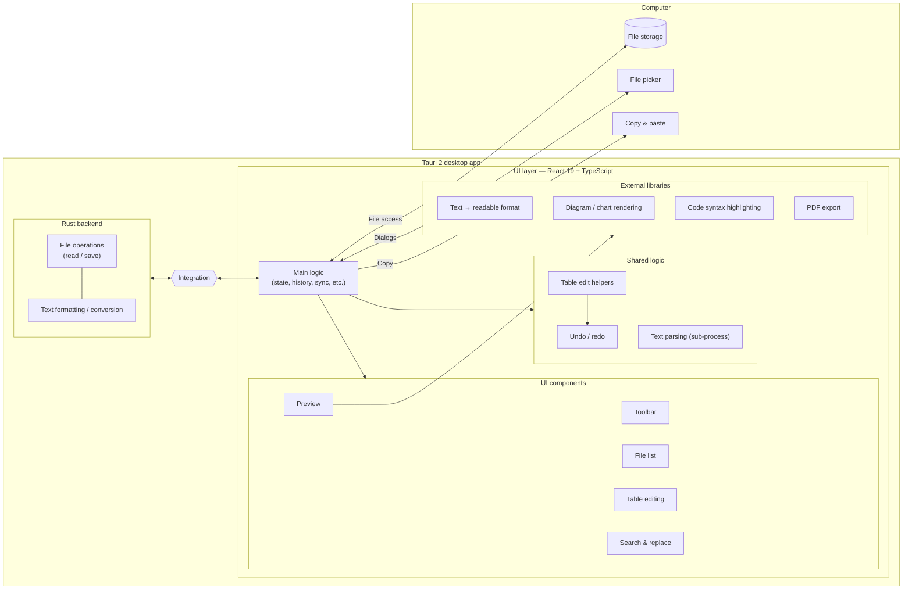
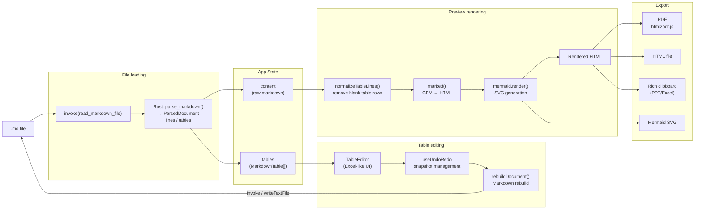
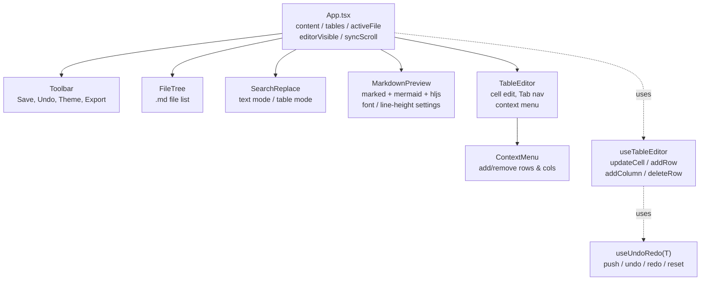

# Markdown Studio

[English](README.md) · [日本語](README.ja.md) · [简体中文](README.zh.md) · [Español](README.es.md) · [हिन्दी](README.hi.md) · [العربية](README.ar.md) · **Português**

Um editor de Markdown para desktop Windows, construído com Tauri 2 + React.

## Recursos

- **Pré-visualização de Markdown** — renderização em tempo real, com tabelas GFM, realce de código e diagramas Mermaid
- **Modo de edição de tabelas** — edite tabelas célula por célula com uma interface parecida com o Excel
- **Barra de formatação** — negrito, itálico, títulos, listas, código, links e mais (Ctrl+B / Ctrl+I)
- **Sincronização de rolagem** — mantém as posições de rolagem do editor e da pré-visualização sincronizadas
- **Localizar e substituir** — funciona tanto no modo de pré-visualização (texto completo) quanto no modo de edição de tabelas
- **Configurações de fonte e exibição** — fontes ajustáveis (incluindo fontes japonesas como Meiryo, Yu Gothic, MS PMincho), tamanho da fonte e altura da linha
- **Exportação** — PDF, HTML, Word (.docx) e cópia rica (formatada) para a área de transferência
- **Árvore de arquivos** — abra uma pasta e navegue/alterne entre arquivos `.md`
- **Tema** — alternância claro / escuro
- **Ocultar editor** — alterne para o modo somente pré-visualização (Ctrl+\\)
- **Desfazer / Refazer** — histórico das operações de edição
- **Assistente de IA** (opcional) — transforme o texto selecionado (traduzir, resumir, revisar, tópicos) e gere diagramas Mermaid a partir de uma descrição, usando sua própria chave de API
- **Interface multilíngue** — 7 idiomas (English, 日本語, 简体中文, Español, हिन्दी, العربية, Português), detectados automaticamente a partir do idioma do seu sistema operacional e alteráveis a qualquer momento nas Configurações

## Download

**Portável de 64 bits para Windows (não requer instalação):**

[markdown-sheet-v1.6.0.exe.dat](https://github.com/5843435/markdown-sheet/raw/main/markdown-sheet-v1.6.0.exe.dat)

> Distribuído com a extensão `.dat` para ambientes em que downloads das GitHub Releases são bloqueados.

### Passos de configuração
1. Baixe pelo link acima
2. Renomeie o arquivo para `markdown-sheet.exe`
3. **Clique com o botão direito no exe → Propriedades → marque "Desbloquear" em "Segurança: Este arquivo veio de…" → OK**
4. Dê um duplo clique para executar

## Configuração de desenvolvimento

```powershell
cd markdown-sheet
npm install
npm run tauri dev
```

## Build (instalador MSI)

```powershell
cd markdown-sheet
npm run tauri build
```

Os artefatos do build são gravados em `src-tauri/target/release/bundle/msi/`.

## Pilha de tecnologias

| Item | Detalhes |
| --- | --- |
| Framework | Tauri 2 + React 19 |
| Linguagem | TypeScript |
| Ferramenta de build | Vite 6 |
| Analisador de Markdown | marked v17 (GFM) |
| Diagramas | Mermaid v11 |
| Realce de sintaxe | highlight.js |
| Exportação de PDF | html2pdf.js |
| Internacionalização | i18n personalizado e leve (7 idiomas, sem dependências em tempo de execução) |

## Atalhos de teclado

| Tecla | Ação |
| --- | --- |
| Ctrl+S | Salvar |
| Ctrl+Z | Desfazer |
| Ctrl+Y | Refazer |
| Ctrl+B | Negrito |
| Ctrl+I | Itálico |
| Ctrl+F / Ctrl+H | Localizar e substituir |
| Ctrl+Shift+C | Cópia rica |
| Ctrl+\\ | Alternar editor |
| F11 | Pré-visualização em tela cheia |

## Internacionalização

A interface é fornecida em 7 idiomas. No primeiro início, o aplicativo detecta o idioma do seu sistema operacional e retorna para o inglês caso ele não seja suportado. Você pode alterar o idioma a qualquer momento em **Configurações → Idioma**; a escolha é lembrada.

As traduções ficam em [markdown-sheet/src/i18n/locales/](markdown-sheet/src/i18n/locales/) — um arquivo por idioma, todos baseados nas chaves de `en.ts` (a fonte da verdade). Para adicionar um idioma, crie um novo `<code>.ts` implementando todas as chaves de `en.ts` e registre-o em [markdown-sheet/src/i18n/index.tsx](markdown-sheet/src/i18n/index.tsx).

---

## Arquitetura

### Estrutura geral



### Fluxo de dados



### Árvore de componentes


