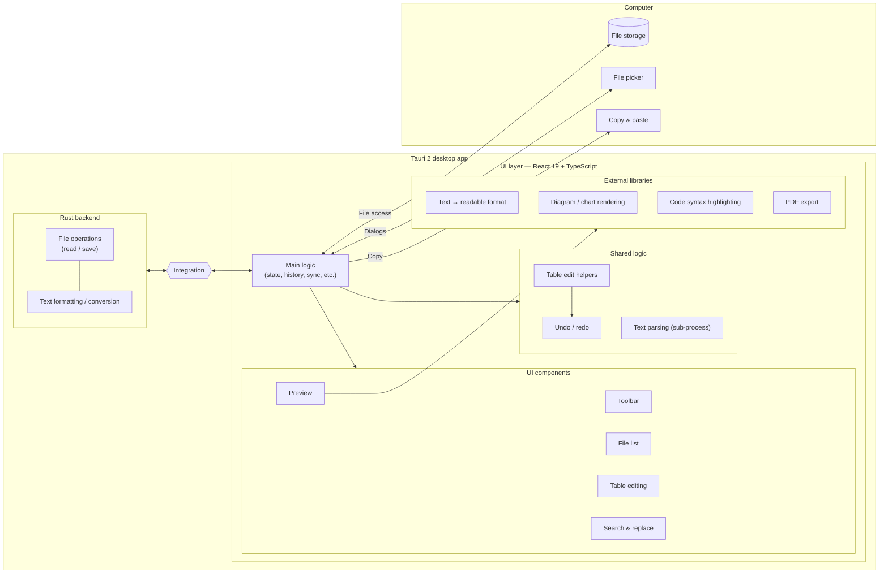
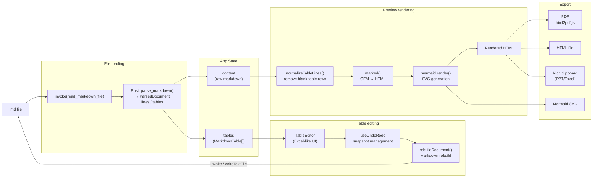
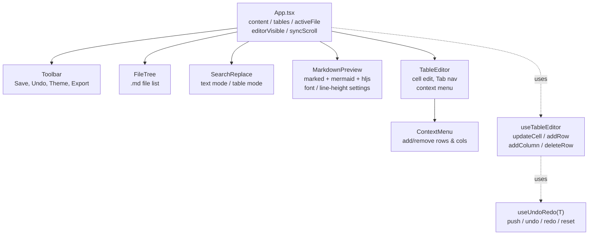

# Markdown Studio

[English](README.md) · [日本語](README.ja.md) · **简体中文** · [Español](README.es.md) · [हिन्दी](README.hi.md) · [العربية](README.ar.md) · [Português](README.pt.md)

一款面向 Windows 桌面的 Markdown 编辑器，基于 Tauri 2 + React 构建。

## 功能特性

- **Markdown 预览** — 实时渲染，支持 GFM 表格、代码高亮和 Mermaid 图表
- **表格编辑模式** — 通过类 Excel 的界面逐个单元格编辑表格
- **格式工具栏** — 粗体、斜体、标题、列表、代码、链接等（Ctrl+B / Ctrl+I）
- **滚动同步** — 让编辑器与预览的滚动位置保持同步
- **查找与替换** — 在预览模式（全文）和表格编辑模式下均可使用
- **字体与显示设置** — 可调整字体（包括 Meiryo、Yu Gothic、MS PMincho 等日文字体）、字号和行高
- **导出** — PDF、HTML、Word（.docx）以及富文本（带格式）剪贴板复制
- **文件树** — 打开文件夹，浏览并在 `.md` 文件之间切换
- **主题** — 明亮 / 暗黑切换
- **隐藏编辑器** — 切换为仅预览模式（Ctrl+\\）
- **撤销 / 重做** — 编辑操作的历史记录
- **AI 辅助**（可选）— 使用你自己的 API 密钥，对选中文本进行转换（翻译、摘要、校对、要点化），并根据描述生成 Mermaid 图表
- **多语言界面** — 7 种语言（English、日本語、简体中文、Español、हिन्दी、العربية、Português），根据操作系统区域设置自动检测，并可随时在设置中切换

## 下载

**Windows 64 位便携版（无需安装）：**

[markdown-sheet-v1.6.0.exe.dat](https://github.com/5843435/markdown-sheet/raw/main/markdown-sheet-v1.6.0.exe.dat)

> 以 `.dat` 扩展名分发，适用于从 GitHub Releases 下载被屏蔽的环境。

### 安装步骤
1. 从上方链接下载
2. 将文件重命名为 `markdown-sheet.exe`
3. **右键点击该 exe → 属性 → 在“安全：此文件来自…”下勾选“解除锁定”→ 确定**
4. 双击运行

## 开发环境搭建

```powershell
cd markdown-sheet
npm install
npm run tauri dev
```

## 构建（MSI 安装程序）

```powershell
cd markdown-sheet
npm run tauri build
```

构建产物会输出到 `src-tauri/target/release/bundle/msi/`。

## 技术栈

| 项目 | 详情 |
| --- | --- |
| 框架 | Tauri 2 + React 19 |
| 语言 | TypeScript |
| 构建工具 | Vite 6 |
| Markdown 解析器 | marked v17 (GFM) |
| 图表 | Mermaid v11 |
| 语法高亮 | highlight.js |
| PDF 导出 | html2pdf.js |
| 国际化 | 轻量级自定义 i18n（7 种语言，无运行时依赖） |

## 键盘快捷键

| 快捷键 | 操作 |
| --- | --- |
| Ctrl+S | 保存 |
| Ctrl+Z | 撤销 |
| Ctrl+Y | 重做 |
| Ctrl+B | 粗体 |
| Ctrl+I | 斜体 |
| Ctrl+F / Ctrl+H | 查找与替换 |
| Ctrl+Shift+C | 富文本复制 |
| Ctrl+\\ | 切换编辑器 |
| F11 | 全屏预览 |

## 国际化

界面提供 7 种语言。首次启动时，应用会检测你的操作系统区域设置，若不支持则回退到英语。你可以随时通过 **设置 → 语言** 更改语言；该选择会被记住。

翻译文件位于 [markdown-sheet/src/i18n/locales/](markdown-sheet/src/i18n/locales/)，每种语言一个文件，全部以 `en.ts`（唯一权威来源）为键。若要添加一种语言，请创建一个新的 `<code>.ts` 文件，实现 `en.ts` 中的每一个键，并在 [markdown-sheet/src/i18n/index.tsx](markdown-sheet/src/i18n/index.tsx) 中注册它。

---

## 架构

### 整体结构



### 数据流



### 组件树


